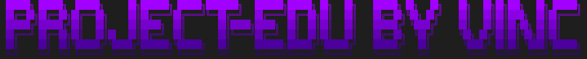
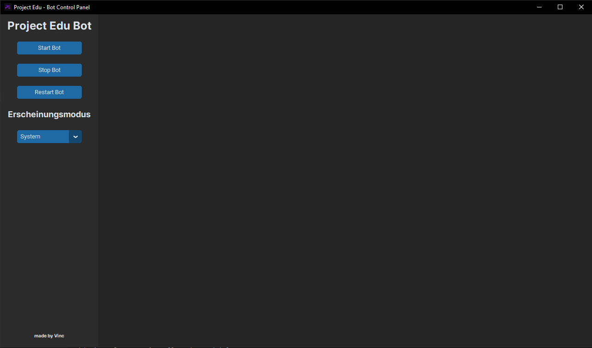

# 🌐 Project Edu Wiki - made by Vinc

Willkommen im Wiki von **Project Edu**! Hier findest du eine detaillierte Dokumentation des Projekts. 📘

---

## 📑 Inhaltsverzeichnis

### Weitere Seiten
| **Seite** | **Beschreibung** |
|-|-|
| [Projektübersicht](01_Projektübersicht.md) | Einführung in das Projekt und seine Ziele, inklusive der Struktur und Motivation. |
| [Features](02_Features.md) | Beschreibung der geplanten Funktionen des Bots, wie Stundenplan, Benachrichtigungen und Statistiken. |
| [Voraussetzungen und benutzte Libraries](03_Voraussetzungen.md) | Technische Anforderungen und verwendete Libraries im Projekt. |
| [Zeitplan](04_Zeitplan.md) | Übersicht des Projektzeitplans und der Meilensteine. |
| [Reflexion und Herausforderungen](05_Reflexion.md) | Reflexion und Dokumentation von Herausforderungen, Schwierigkeiten und Lernerfahrungen im Projekt. |

---

### Diese Seite
- **Projekt Entstehung** ✨
    - Hintergrundinformationen
    - Idee Entstehung
    - Motivation
- **Benutze Technologien** 💻
    - Hardware
    - Programmiersprachen
- **Entwicklung** 🚀
    - Entwicklungsprozess
    - Phasen
    - Meilensteine
- **Bilder** 🖼️
    - Bot Discord Server
    - Control Panel

---

## ✨ Projekt Entstehung

Mein Name ist Vincent und ich besuche die **11. Klassenstufe** eines Gymnasiums. Die Wahl meines Seminarkurses fiel mir leicht, da ich in meiner Freizeit gerne programmiere und großes Interesse an Informatik habe. Im Rahmen des Seminars arbeiten wir an zwei größeren Projekten, von denen eines dieses hier ist.

Am Anfang hatte ich Schwierigkeiten, eine geeignete Projektidee zu finden. Ich wollte nicht wie viele andere ein typisches 2D-Spiel programmieren, sondern etwas schaffen, das meinen Mitschülern echten Nutzen bietet. Als meine Schule auf **EduPage** umstieg, kam mir die Idee: Ein **Discord-Bot** kombiniert mit der EduPage API!

Nachdem ich die **EduPage API** entdeckt hatte, war mir klar, dass ich diese Gelegenheit nutzen wollte. Ich fragte meine Mitschüler nach ihrer Meinung, und obwohl einige Bedenken hatten, ist mein Ziel, das Projekt zu realisieren und gleichzeitig zu lernen, wie man **APIs** und **Discord-Bots** erstellt.

Besonders spannend ist die Möglichkeit, **Benachrichtigungen** abzufangen, z. B. für Raumänderungen. Der Name "Edu" leitet sich einfach von der **EduPage-App** ab.

---

## 💻 Benutze Technologien

### 🛠️ Meine Hardware
- **Computer Case:** NZXT H7 Flow Mid-Tower
- **Motherboard:** MSI Tomahawk B450
- **Prozessor:** AMD Ryzen 5 5600x
- **Grafikkarte:** Asus AMD Radeon Vega 56 OC
- **RAM:** Corsair Vengeance
- **M.2 SSD:** Samsung Evo 970 EVO Plus 1TB
- **SSD:** CT 500 MX500

*(Leistungsstark genug für den Bot)*

### 💻 Programmiersprachen
- **Python**
    - Für den Discord Bot
    - Für das Control Panel
- **SQL**
    - Custom-Datenbankabfragen

---

## 🚀 Entwicklung

Für die Entwicklung habe ich insgesamt **4 Semester** Zeit, weshalb das Projekt in **4 Phasen** unterteilt ist:

#### **I. Struktur und Ideen**
In dieser Phase wurden die ersten Ideen und die Struktur des Projekts ausgearbeitet. Hier lag der Fokus auf der Analyse der EduPage API und dem Brainstorming der Bot-Funktionen.

#### **II. Prototyping**
Die zweite Phase umfasst das Entwickeln eines ersten Prototyps des Discord-Bots, inklusive API-Integration und erster Tests.

#### **III. Erweiterung und Testing**
In dieser Phase werde ich basierend auf dem Feedback meiner Mitschüler weitere Features hinzufügen und den Bot auf Stabilität und Benutzerfreundlichkeit testen.

#### **IV. Fertigstellung und Präsentation**
Schließlich wird das Projekt in der letzten Phase finalisiert, Fehler behoben, die Dokumentation vervollständigt und für die Präsentation vorbereitet.

---

## 🖼️ Bilder

Project Edu Banner

Control Panel Ansicht

Willkommensnachricht im Discord

